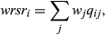

# background readings
### Uses AOH
* Brooks et al 2019 Measuring terrestrial Area of Habitat (AOH) and its utility for the IUCN Red List --> sets out guidelines for delineating AOH and how it differs from EOO and AOO. AOH previously called Extent of Suitable Habitat. ESH was used by Beresford et al 2011, Buchanan et al 2011, Rondinini et al 2011

* Soto-Navarro et al 2020 Mapping co-benefits for carbon storage and biodiversity to inform conservation policy and action 

> We used five metrics as indicators of biodiversity status (table 2; electronic supplementary material, figure S1). As local species-level metrics (S), we used Species Richness–Area of Habitat (SR-AOH) and Rarity-weighted Richness–Area of Habitat (RWR-AOH). As metrics of local ecosystem intactness (E) we used the GLOBIO Mean Species Abundance (MSA) [53,62] and the PREDICTS Biodiversity Intactness Index (BII) [55,56,58,63]. Finally, as a measure of regional habitat condition (c), we used the CSIRO Biodiversity Habitat Index (BHI) [59], which is a measure of average habitat condition across the broader area supporting, or previously supporting, a similar natural assemblage of species to the location of interest.

* Hanson et al 2020 - Global conservation of species’ niches --> includes code in SM

* Gallego-Zamorano et al 2020 - Combined effects of land use and hunting on distributions of tropical mammals --> incorp AOH and hunting pressure data

* O'Bryan et al 2020 - The importance of Indigenous Peoples’ lands for the conservation of terrestrial vertebrates --> uses AOH for terrestrial mammals (4460 sp)

> We excluded species considered extinct and any other extant native and reintroduced species whose area of habitat maps did not fully intersect with the combined spatial datasets employed in this study (4,460 species included, and 1,070 species were excluded from the analysis, many of which had a portion of their range on islands and other features outside the extent of our combined spatial intersection layers).

### Forest vertebrates
* Buchanan et al 2011 - 

> We analysed the subset of 6,077 species (representing 60.6% of all extant bird species) that are scored in BirdLife International’s World Bird Database as having high or medium forest-dependence [10]. Species with high forest-dependence are forest specialists that are characteristic of the interior of undisturbed forest, rarely occupy non-forest habitats, and almost invariably breed within forest; while they may persist in secondary forest and forest patches if their particular ecological requirements are met, they are usually less common in such situations. Species with medium forest-dependence are forest generalists that breed in undisturbed forest but are also regularly found in forest strips, edges and gaps and secondary forest, where they may be commoner than in the interior of intact forest. For each of these forest-dependent species, altitudinal limits were also extracted from the same source [10] and the EOO maps were clipped by forest cover and altitude to produce maps of the extent of potentially suitable habitat (ESH) within the EOO of each species [13,35]. ... The resulting maps of ESH therefore included, for each forest species, all the 5-km cells within that species’ EOO that had partial or complete forest cover in the year 2000 and that fell at least partly within the altitudinal limits of that species.

* Rondinini et al 2011 - Global habitat suitability models of terrestrial mammals --> the paper on which all others cite for forest mammals. but doesnt specify which are forest specialists?

> We used the geographical range (in ESRI shapefile format) and habitat preferences information obtained from the IUCN Red List as a baseline for developing habitat suitability models for 5027 out of 5330 (94.3%) extant terrestrial (including coastal and flooded habitat) mammals. ... When known and recorded in the IUCN Red List, the information on the elevation range within which a species occurs is expressed as a minimum – maximum range in metres and as such used in the analysis. The rest of the information on habitat preferences, including the preferred habitat types, tolerance to human impact on natural habitat types and close relationship with water bodies are in the form of a tex- tual description, and were extracted in two steps. First, we assigned each species to one or more broad habitat types (forest, shrubland, grassland, bare and artificial) ... Species assigned to only one broad habitat type (forest, shrubland, grassland, bare and flooded) were considered habitat specialists, while the remaining species were considered habitat generalists. ... All cells in the model inside the elevation range of the species retained the suitability score assigned to the land-cover map, while the other cells were classified unsuitable.

* Ficetola et al 2014 - Habitat availability for amphibians and extinction threat- a global analysis --> the paper on which all others cite for forest amphibians. has a species list but does not actually indicate which they consider as forest specialists. 

> First, we read the IUCN reports and identified the presence of each species in one or more broad habitat categories (forest, shrubland, grassland, bare and artificial). ... 
The information on the minimum and maximum eleva- tion within which each species lives, if available, was obtained from the IUCN Red List. Due to the uncertainty on the true elevation range of many species, the elevation range was extended 300 m either side. ... Species were classified as (1) forest specialist; (2) species living in open habitats (e.g. shrubland and grassland); (3) habitat generalists (i.e. using both forest and open habitats).

* Tracewski et al 2016 - Toward quantification of the impact of 21st-century deforestation on the extinction risk of terrestrial vertebrates --> forest-dependent vertebrates (3540 amphibians, 6283 birds and 1363 mammals). high/med dependency birds following Buchanan et al 2011. has a species list but does not indicate which they consider to be forest-specialists. maybe all?

> Forest-dependent bird species were defined as those having high dependency or medium dependency (following Buchanan et al. 2008; Bird et al. 2012). Species with high dependency are characteristic of the interior of undisturbed forest; they may persist in secondary forest and forest patches if their particular ecological requirements are met, but breed almost invariably within forest. Species with medium dependency may occur in undisturbed forest but are also found in forest strips, edges and gaps, and typically breed within forest (BirdLife International 2015). For amphibians and mammals, we considered forest specialists to be those that have a high dependency on forests (Rondinini et al. 2011; Ficetola et al. 2015). These species are characteristic of the interior of undisturbed forest; they may persist in secondary forest and forest patches if their particular ecological requirements are met, but breed almost invariably within forest. ... We used distribution polygons with presence coded as extant or probably extant and origin coded as native or reintroduced. We extracted data on altitude preferences and generation lengths ... Altitude limits were not known for 18% of amphibians, 22% of birds, and 50% of mammals. In these cases, we used the minimum and maximum values within the species range (Beresford et al. 2011; Rondinini et al. 2011)

* Hill et al 2019 - Measuring forest biodiversity status and changes globally --> follows Tracewski et al 2016 coding of forest-dependent species (3565 amphibians, 6841 birds, 1463 mammals and 393 conifers)

> Using the IUCN Red List dataset (www.iucnredlist.org), we extracted spatial data on distributional boundaries and tabular data on habitat preferences and elevation limits for birds, mammals, and amphibians (provided by IUCN in October 2017) and conifers (in November 2017). Following Tracewski et al. (2016), we defined forest-dependent species as those birds coded by BirdLife International as having high or medium forest dependency (Buchanan et al., 2008; Bird et al., 2012), and those mammals and amphibians coded by Rondinini et al. (2011) and Ficetola et al. (2015), respectively, as having high forest dependency. 

* Green et al 2020 - Below the canopy: global trends in forest vertebrate populations and their drivers --> but uses vertebrate populations rather than species range maps. calculate a Forest Specialist Index.

> We defined forest specialists using the habitat coding from the IUCN Red List [3]. Those with ‘Forest’ listed as one of multiple major habitats for that species were considered forest generalists, while those with only ‘Forest’ listed as the major habitat were considered forest specialists. This definition of specialist is narrow as the ‘Forest’ category from the IUCN Red List refers to natural habitat and does not include artificial habitats such as plantations

* IUCN red list website (https://www.iucnredlist.org/resources/other-spatial-downloads) has species richness and rarity-weighted species richness rasters, which they create by defining species as extant (presence=1) or possibly extinct (presence=4), native (origin=1) or reintroduced (origin=2) for terrestrial mammals, amphibians and birds

* Allan et al 2021 preprint - terrestrial mammals (n=5617), amphibians (n=6577), birds (n=10,926), reptile (n=9964)

### Species richness in ILs or PAs
* Wolf et al 2021 - A forest loss report card for the world’s protected areas

> calculate effectiveness of PAs in reducing deforestation, then multiply that with forest vertebrate species richness to come up with some kind of threat index. but only for matched PAs. 
"We used the data on forest loss in and around PAs to explore how area protected and PA effectiveness relate to forest obligate species richness, forest carbon stocks and deforestation rates within countries. For each country, we calculated: (1) forest obligate vertebrate species richness; (2) forest carbon stocks; (3) average forest loss rate; (4) overall PA effectiveness (with respect to limiting deforestation); and (5) percentage of forested area protected (Supplementary Methods). PA effectiveness at the country level was estimated using the ratio of the mean deforestation rate in control areas to the mean deforestation rate of PAs within the country. For each country, we refer to this ratio as its PA effectiveness score. To simplify interpretation, we restricted our scope to countries with at least 15 PAs in our main analysis, 5 forest obligate vertebrate species and 10,000 km2 of forested land.
We then computed the species threat index, which we defined as the ratio of forest species richness to proportion of forested area protected multiplied by the PA effectiveness score. Countries with high species threat index scores have little protection relative to the number of forest species present. Thus, this analysis identifies countries where improvements in PA quantity or quality (that is, effectiveness at reducing deforestation rates) may have the most beneficial total impact on forest biodiversity. We also calculated variants of the species threat index score using the overall forest loss rate and (log-transformed) aboveground forest carbon biomass in place of species richness. In summary, we computed the following three threat indices, I, for each country:
ISpecies = Species / (Prot.*Score); 
ILoss = Loss / (Prot.*Score);
ICarbon = log10(Carbon)/(Prot.*Score);
where ‘Species’ is the total number of forest vertebrate species in the country, ‘Prot.’ is the proportion of forested land protected, ‘Score’ (a measure of effectiveness) is the total forest loss in control areas divided by total forest loss within PAs, ‘Loss’ is the estimated annual deforestation rate and ‘Carbon’ is the aboveground forest biomass in units of Gt C. Each index is strictly positive, with higher values indicating potential conservation issues because they suggest that the level of protection in a country is not commensurate with its biodiversity, deforestation pressure, or forest carbon stocks."

* Cazalis et al 2020 - Effectiveness of protected areas in conserving tropical forest birds (Nature Communications)

> In terms of 'effectiveness', looking at "whether the diversity of species and ecosystems and the most important sites is covered", or "makes a difference to the trends and thus ultimately to the condition of the species and ecosystems within their boundaries". use ebird checklist, looked at species richness amongst all birds, restricted range birds, threatened birds, forest-dependent birds. PAs mitigate forest degradation.

* O'Bryan et al 2020 - The importance of Indigenous Peoples’ lands for the conservation of terrestrial mammals (Conservation Biology)

> used Garnett's IPL and low human pressure maps. AOH data for 4460 mammals from IUCN data (rondinini et al I think). 2175 (49%) have ≥10% of ranges in IL, 646 (14%) have ≥50% of ranges. 413 threatened species (41% of threatened species) have range on IL. 

* Schuster et al 2019 - Vertebrate biodiversity on indigenous-managed lands in Australia, Brazil, and Canada equals that in protected areas (Env. Science & Policy)

> Indigenous-managed lands and PAs have similar levels of vertebrate biodiversity, slightly more actually, and in Brazil and Canada they have more threatened vertebrates. Estimated total richness of amphibians, birds, mammals and reptiles of IUCN species range maps. Specifically looking at Indigenous-managed lands, so not counting Garnett's IPL paper. Australia's Indigenous PAs, Brazil was from WDPA but governed by Indigenous, and Canada's Aboriginal lands, so inc. PAs but managed by IP. Created 10,000 random points that are not in PA, not in IL in each country, without excluding urban and peri-urban areas. then create centroid around these points, with the area corresponding to that of PAs and ILs. then compare the species richness of these spaces. GLMM of neg bin, log link, resp~land type + xycoord + area, for total sp richness, sp richness by species group, threatened sp richness, threatened sp richness by species group.

"These data have certain limitations, including possible underestimation of the extent of occurrence and overestimation of the true area of occupancy (Pouzols et al., 2014), but have been shown to be robust to commission errors as long as the focus is on species assemblages rather than single species, (Venter et al., 2014)."

* Corrigan et al 2018 - Quantifying the contribution to biodiversity conservation of protected areas T governed by indigenous peoples and local communities (Biological Conservation)

> Focused on Australia, Brazil and Namibia PAs reported to be under Indigenous management. used GFW forest loss and gain in PAs of Indigenous or Other management. also overlaid IUCN Red List data on mammal amphibian and bird species potentially occuring in PAs of Indigenous or Other management and counted total number of all species and all threatened species per country. Also looked at how much ecoregion covered by one or other PA. 

* Renwick et al 2017 - Mapping Indigenous land management for threatened species conservation: An Australian case-study

> use distributions of threatened native vertebrate species and analyse overlap in ranges for 272 terrestrial and freshwater species with IPA. Count number of species which have range that overlap with ILs and proportion of each species range that overlaps. Determine the number of species that occupy a 10km2 grid. 

# draft writings
### Research questions
Looking at forest-dependent mammals amphibians reptiles and birds (11872 sp; 1472 amphibia, 6459 birds, 1759 mammals and 2182 reptiles) and subset of threatened species.
find out the number of species that overlap, for each country. proportion of range that overlap. 
how much better is protection for these species based on deforestation? probably something similar to wolf et al 2021 with the threat index. possibly also incorporating countries' governance accountability corruption etc. like the RRI report that wasnt published (look into that with Thomas Worsdell?)
given future deforestation likelihood, where are going to be important?

find 'hotspots' of richness. which areas they fall in? range-rarified species richness would say how important that pixel is more than just species richness.

much prefer going down to some case studies. bring in differences of legal recognition and autonomy. Australia and Canada have greatest autonomy, but not really tropical forests. maybe peru? where indigenous lands are mostly recognised by govt. vs congo or somewhere where ILs not recognised at all?

after meeting on 6 Sep. 
qn 1. how have species richness changed from 2010 to 2018 based on deforestation 

for each species, how much of its range lies within PAs, ILs, PIAs, or non-protected? how much of its range was deforested between 2010 and 2018, how does that compare between different protection types (not matched)

where are the hotspots of loss (based on deforestation), areas of concern. 

### Introduction
forest specialists, acknowledging that almost all ecosystems are modified by humans at some point in time at some level (Ellis et al 2021), but qualitatively different industrial plantations

Corrigan et al 2018 - Quantifying contribution to biodiversity con of PAs governed by IP and local communities

Ribeiro et al 2018 - Effectiveness of PAs and IPL in representing  threatened plants Brazil

Rodrigues et al 2004 - Global gap analysis-priority regions for expanding global PA network

Schuster et al 2019 - Vertebrate biodiversity on ILs in Aus Brazil and Canada equal that in PA

O'Bryan et al 2020 - The importance of Indigenous Peoples’ lands for the conservation of terrestrial mammals

### Methods

Forest vertebrates - 11,872 sp
AOH - 11,870 sp

small range sizes (centre of cell doesn't fall within species distribution polygon) - Amphibians Tachiramantis lassoalcalai and Arthroleptis nikeae. Mammals Eudiscoderma thongareeae and Murina balaensis. Reptiles Cnemaspis baueri, Enulius bifoveatus, Gekko bannaense, Matoatoa spanringi, Pseudocalotes drogon, Pseudocalotes rhaegal, Tytthoscincus batupanggah, Tyttoscincus cophias and Tytthoscincus leproauricularis 

species doesnt fall within tropical forest 2018 area. Bird Hypotaenidia sylvestris (Lord Howe Island). Reptile Pseudocalotes viserion (in a patch of no forest within Peninsula Malaysian montane rain forests)

"We produced 12 species richness layers in total: all amphibians, birds and mammals; small-range amphibians, birds and mammals; all critically endangered, endangered and vulnerable species; and small-range critically endangered, endangered and vulnerable species. Species richness was calculated from the rasterized IUCN Red List species range maps (IUCN 2014) by summing the values of each raster grid cell in the IUCN range maps corresponding to each richness layer (i.e., to produce a richness layer for small-range amphibians, we summed the IUCN range maps for small-range amphibians). We defined small-range species as those with a range <50,000 km2 (Rodrigues et al., 2004; Stattersfield, Crosby, Long, & Wege, 1988). Prior to calculating species richness, we reclassified the pixel values of each raster (described above) from either 0.5 to 1.0 or 0.1 to 0.0 using the Reclassify function in arcgis 10.1 (ESRI 2012) to base the species richness calculation on presence/absence data rather than probability of occurrence.

The weighted range size rarity (Williams, Gibbons et al., 1996) map included in this study was created automatically from the Zonation spatial prioritization analysis (Moilanen et al., 2014) based on 21,075 species range maps. Weighted range size rarity for each cell, i, is defined as 

where wj is the weight assigned to species j in the prioritization and qij is the fraction of species j's range falling within cell i (Moilanen et al., 2014). This measure lowers the contribution of wide ranging species to overall species richness and highlights the areas that have a relatively high proportion of narrow-range species." - https://onlinelibrary.wiley.com/doi/10.1111/ddi.12571 
